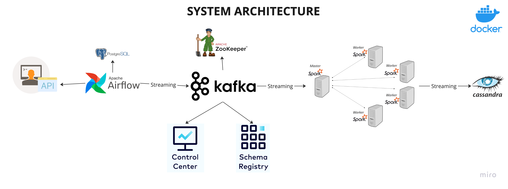

# Real-Time Data Streaming | Comprehensive Data Engineering Project


## Introduction

This project provides a detailed guide to creating a complete data engineering pipeline. It walks you through each phase from data ingestion to processing and storage, using a robust technology stack including Apache Airflow, Python, Apache Kafka, Apache Zookeeper, Apache Spark, and Cassandra. The entire setup is containerized with Docker for simplified deployment and scalability.

## System Architecture



The architecture of the project includes:

- **Data Source**: Utilizes the `randomuser.me` API to generate random user data for the pipeline.
- **Apache Airflow**: Manages pipeline orchestration and stores data in a PostgreSQL database.
- **Apache Kafka and Zookeeper**: Facilitate data streaming from PostgreSQL to the processing engine.
- **Control Center and Schema Registry**: Monitor and manage the schema of Kafka streams.
- **Apache Spark**: Handles data processing with a master-worker setup.
- **Cassandra**: Stores the processed data.

## Learning Outcomes

- How to establish a data pipeline using Apache Airflow
- Techniques for real-time data streaming with Apache Kafka
- Distributed synchronization using Apache Zookeeper
- Data processing with Apache Spark
- Data storage methods with Cassandra and PostgreSQL
- Containerization of the entire data engineering workflow with Docker

## Technologies Used

- Apache Airflow
- Python
- Apache Kafka
- Apache Zookeeper
- Apache Spark
- Cassandra
- PostgreSQL
- Docker

## Setup Instructions

1. Clone the repository:
    ```bash
    git clone https://github.com/airscholar/e2e-data-engineering.git
    ```

2. Change to the project directory:
    ```bash
    cd e2e-data-engineering
    ```

3. Start the services using Docker Compose:
    ```bash
    docker-compose up
    ```

For detailed setup instructions, refer to the video tutorial linked below.

#### SOURCE Tutorial
Watch the original [YouTube Video Tutorial](https://www.youtube.com/watch?v=GqAcTrqKcrY).

